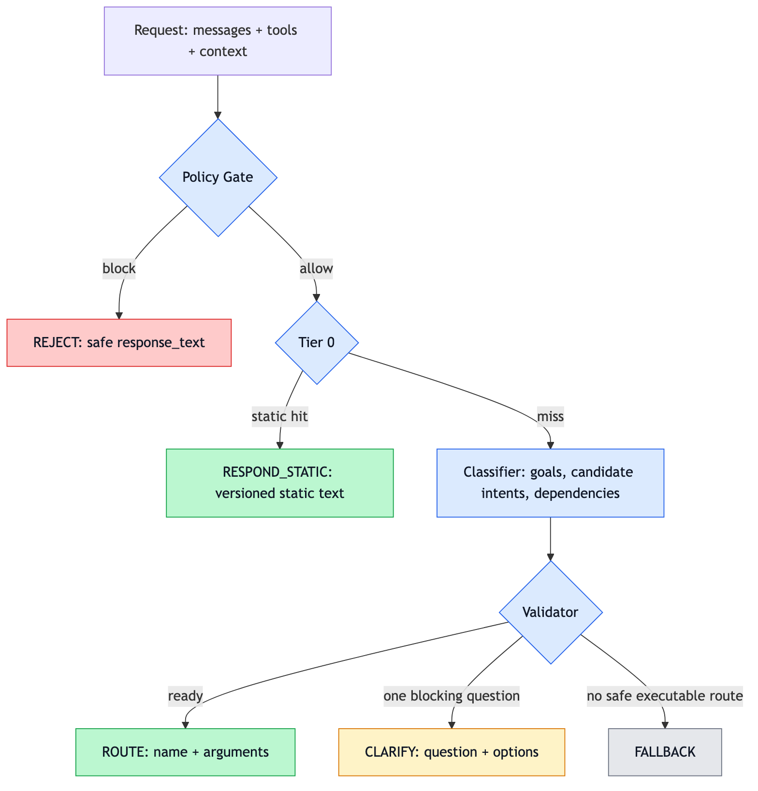
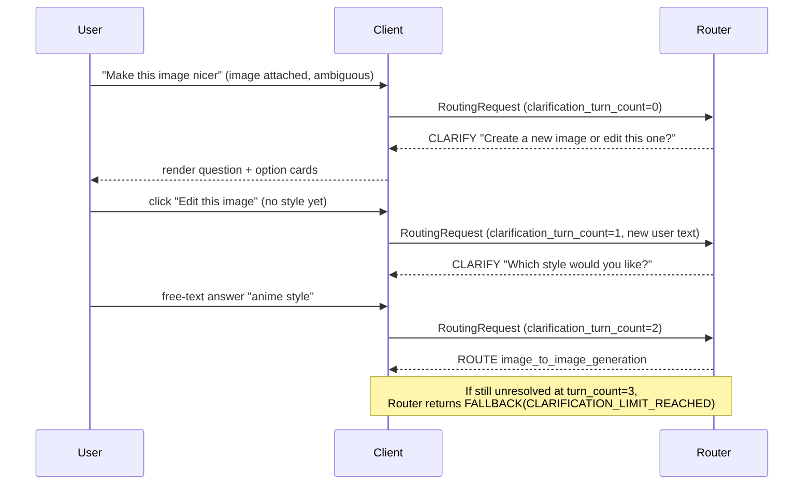
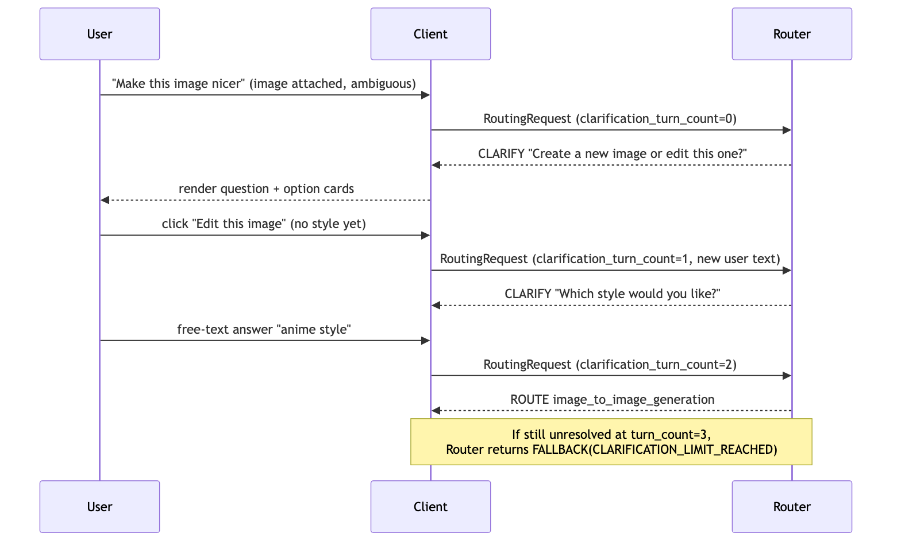
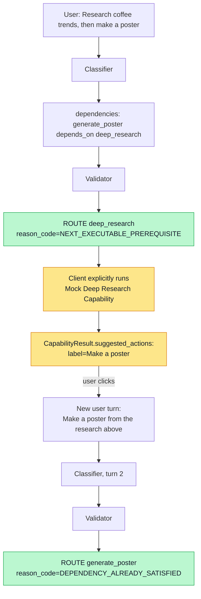
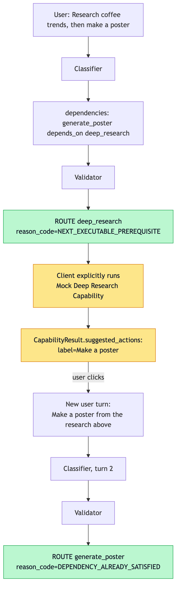
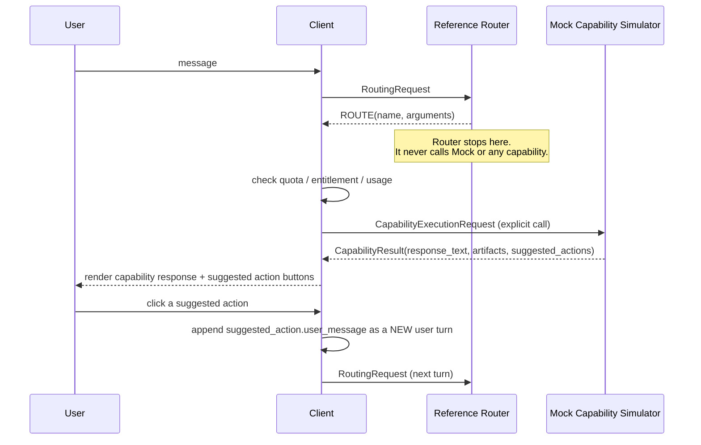
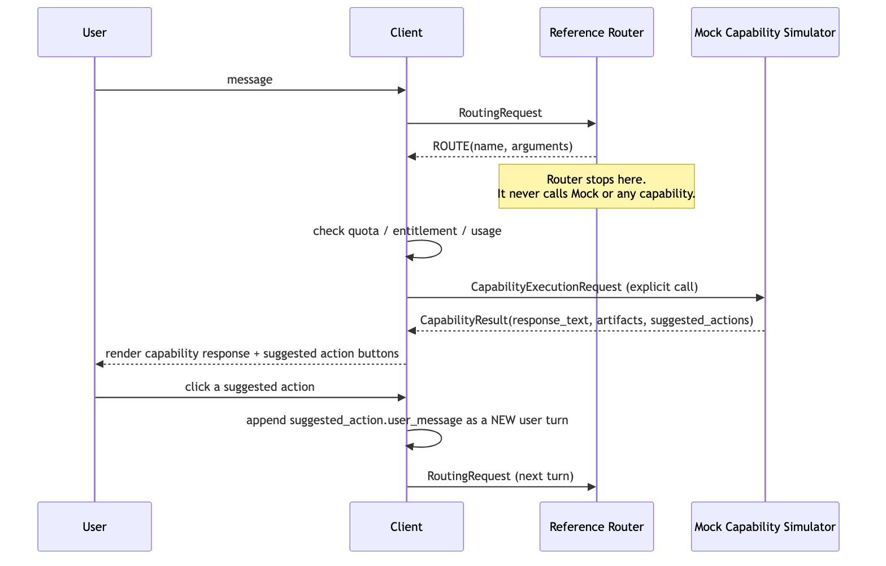
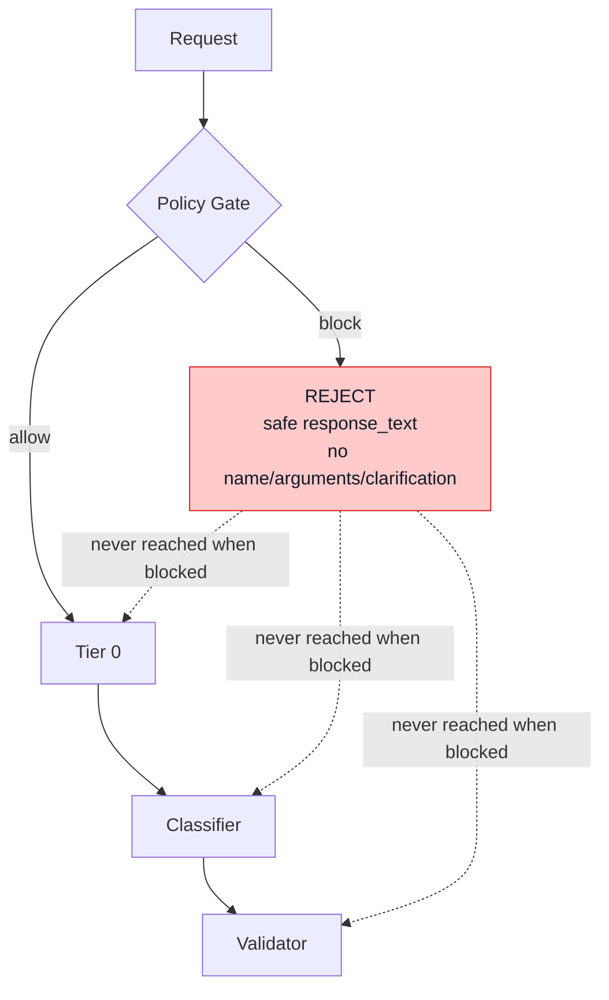
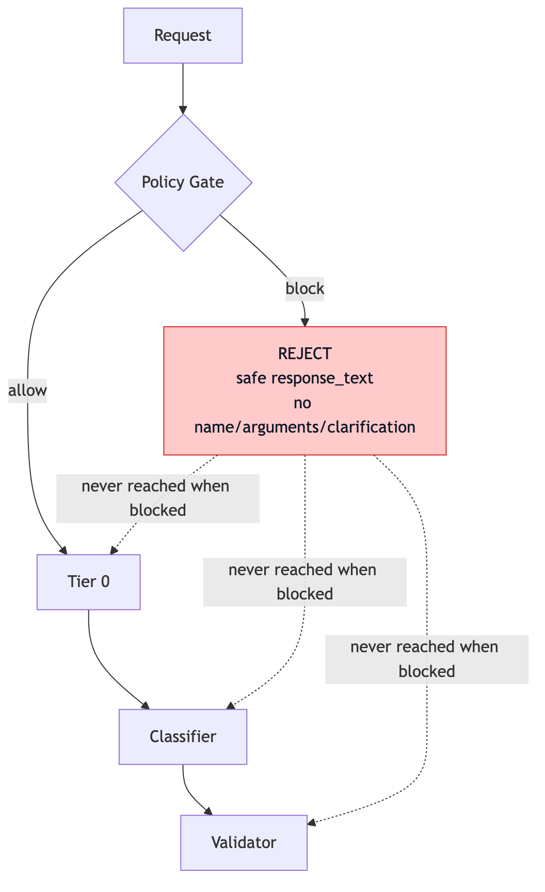

# V1 Reference Runtime

Tài liệu này mô tả `reference_runtime/` — acceptance demo + model benchmark harness
cho Intention Detection & Routing V1 (architecture amendment 2026-08-06 / playground
handoff 2026-08-07). Độc lập với Comparison Lab. Không thay thế BE/AI DocAtlas docs.

Nguồn tham chiếu:

- BE WIP: DocAtlas `research-intention/wip/be-v1/` (§5–§6, §10, §17)
- API Contract notes: `wip/be-v1/API Contract.md`

## 1. Vì sao có package riêng

`reference_runtime/` tách hoàn toàn khỏi `core/` và `routers/` (Comparison Lab).

- **Comparison Lab** — so sánh providers trên taxonomy; không có 5 outcomes / policy / validator.
- **V1 Reference** — pipeline đầy đủ + public contract §10 + benchmark để chọn model Intention V1.

## 2. Divergences đã ghi nhận

| Điểm | BE §10 / locked V1 | Demo này | Vì sao |
|---|---|---|---|
| Outcome direct answer | `RESPONSE` | `RESPONSE` (pre-router static **hoặc** router LLM) | Aligned 2026-08-07 |
| `reason_code` | Internal only | Internal only (`InternalTrace`); public via `to_public_response` | Aligned |
| Public wire | camelCase + `INTENTION_DETECT_OUTCOME_*` | `to_public_request` / `to_public_response` | Aligned |
| Pre-router | Exact static only | Exact static only | Aligned |
| `deep_research.arguments` | TBD in product | `{"final_prompt": "..."}` demo | Partial reuse from nexus |
| Capability execution | Client-owned | Mock Capability Simulator (outside router) | Demo only |

## 3. Kiến trúc tổng thể

```text
Normalize → Policy Gate → Pre-router (exact static) → Structured LLM Router (≤1)
         → Deterministic Validator → RESPONSE | ROUTE | CLARIFY | FALLBACK | REJECT
```

Public Client JSON never includes stage traces, reason codes, goals, or dependencies.
INTERNAL inspector in the UI shows those for debugging only.

### Model selection benchmark (DocAtlas §15.3)

Three selection metrics only: **accuracy** (public outcome; ROUTE needs correct
capability name), **latency** (router-stage p95 ms — not pre-router `<50ms`),
**cost** (mean `total_tokens`; optional `$` from `pricing_snapshot.yaml`).

```bash
make benchmark                          # Fake CI smoke
make benchmark PROVIDERS=fake,gemini,openai   # env GEMINI_MODEL / OPENAI_MODEL
make benchmark-select                   # all default candidates in parallel
```

Default candidates: `gpt-5.6-luna`, `gemini-3.5-flash-lite`, `gpt-5-nano`,
`gpt-5.4-nano`, `gemini-3.1-flash-lite`, `gpt-5-mini` (+ Fake when
`--include-fake`). Default suite is **`core`** (clear routing cases only);
prompt-hard dependency/CLARIFY cases are `--suite deferred` until prompt fix.
Use `--suite all` for full regression. Ranking among models that pass the
proposed accuracy floor (default `0.75`, Product approves): accuracy → latency
→ tokens → `$`.

Reports: per-model `benchmark_<model>.json` plus `benchmark_comparison.md`
(primary / fallback / proposed floor) under `benchmark_reports/`.



Router invariants được enforce bằng code, không chỉ bằng convention:

- `ReferenceRouter.route()` luôn trả đúng một `ReferenceRunResult` (public response
  + internal trace); `tests/reference/test_runtime.py` verify exactly-one-outcome.
- `reference_runtime/runtime.py` không `import` `capability_simulator` ở bất kỳ đâu
  — verify bằng AST parse trong test, không chỉ bằng đọc code bằng mắt.
- `RoutingResponse` không có field `confidence` nào (Pydantic model fields, verify
  bằng test) và không expose `dependencies`/`goals` — các field này chỉ tồn tại
  trong `InternalTrace.router_decision`. Public wire dùng `to_public_response()`.

## 4. Multi-turn clarification





Quy tắc cứng: mỗi response chỉ hỏi một câu, tối đa 3 option, free-text luôn được
phép, và tối đa 3 clarification turns trước khi bắt buộc `FALLBACK`. Client là bên
giữ lịch sử hội thoại và gửi answer lại như một user turn mới — Router không tự
resume hay giữ hidden state giữa các turn.

Giới hạn V1.0: `clarification_turn_count` là giá trị Client tự khai báo, nên một
Client lỗi hoặc cố ý reset counter có thể bypass giới hạn này. Demo chấp nhận
trade-off đó vì không có server-side conversation persistence; production cần
derive/verify counter từ conversation state do server tin cậy.

## 5. Dependency-aware next executable intent (coffee scenario)





Router chỉ chọn **một** next executable intent mỗi lần — nó không trả execution
plan và không tự động chuyển sang `generate_poster` sau khi chọn `deep_research`.
Việc "resume" phụ thuộc hoàn toàn vào conversation context ở turn kế tiếp
(best-effort, không phải structured continuation state).

Các biến thể khác của dependency analysis được implement trong
`reference_runtime/classifier/fake.py` và cover trong
`reference_runtime/scenarios.py`:

- Independent intents ("Tìm tin mới và tạo ảnh một con mèo") → chọn theo thứ tự
  user nhắc tới trước, không execute cả hai.
- Blocked reference chỉ thiếu thông tin ("báo cáo chưa tồn tại") → `CLARIFY`.
- Unsupported prerequisite (phụ thuộc một thứ ngoài taxonomy) → `FALLBACK`.
- Cyclic dependency (fixture minh hoạ) → `FALLBACK`, phát hiện bằng structural
  check trong Validator, độc lập với `reason_code` mà classifier tự báo cáo.

## 6. Router vs Client vs Mock Capability boundary

**Quyết định đã chốt: Capability tự tạo post-execution response và
`suggested_actions`. Router không bao giờ trả `continuation_hint` hoặc
`remaining_goals`.**





Ranh giới quan trọng, enforce bằng test (`tests/reference/test_runtime.py`,
`test_capability_simulator.py`):

- `reference_runtime/runtime.py` không `import`
  `reference_runtime.capability_simulator` — Router không thể invoke capability
  by construction, không chỉ theo quy ước.
- Mock Capability Executor không nằm trong dependency graph của Router; UI gọi
  nó qua một nút bấm **"Run mock capability"** riêng, luôn label rõ
  `Mock capability execution`.
- Nếu mock capability thất bại (`status=failed`), UI không render success
  recommendation và không có `suggested_actions`.
- Click vào suggested action là hành động user xác nhận: UI submit một user turn
  mới và gọi Router cho turn đó. Nó không tự execute capability tiếp theo; capability
  chỉ chạy khi user bấm nút **Run mock capability** riêng.

**Quan trọng: Mock capability response là một demo contract để chứng minh
capability-side response/recommendation contract và Client UX. Đây KHÔNG phải
bằng chứng rằng capability thật hiện tại (ví dụ Deep Research service trong
`ms-smith-nexus`) đã support `suggested_actions`. Real capability execution
thuộc phạm vi V1.1, không phải Definition of Done của V1.0.**

## 7. REJECT short-circuit





`REJECT` là một terminal outcome:

- Policy Gate chạy trước Tier 0 và Classifier trong mọi request.
- Khi block, Router trả `REJECT` ngay lập tức; Tier 0/Classifier/Validator không
  bao giờ được gọi trong cùng request đó — verify bằng test đếm số lần gọi
  (`test_reject_short_circuits_tier0_and_classifier`), không chỉ kiểm tra output.
- Client render `response_text` an toàn rồi dừng lại; **không** fallback sang
  current chat, vì làm vậy có thể bypass policy.
- Policy category chi tiết (`weapons_instructions`, `csam`, `self_harm_instructions`,
  ...) chỉ nằm trong sanitized internal trace, không bao giờ vào public response.
- Generic "NSFW" không tự động là violation; chỉ khi evaluator (ở đây là
  `PolicyGate` deterministic fixture) trả blocking decision.

### Text surfaces (normalize)

Normalize tạo **hai** representation (không coi folded là canonical duy nhất):

```text
raw_text
  → canonical_text  # NFKC + casefold + punctuation→space + collapse ws (giữ dấu)
  → folded_text     # canonical + fold dấu tiếng Việt (lossy)
```

| Stage | Surface |
| --- | --- |
| Policy Gate | `canonical` primary; `folded` chỉ khi rule `surfaces` opt-in |
| Pre-router / Tier 0 | `folded` (exact phrase lookup) |
| LLM Router | `raw` conversation turns |
| InternalTrace | `canonical_text` + `normalized_text` (= folded, legacy) |

Policy `rule_version = policy-v2`. Khi phát hiện mixed Latin+Cyrillic, Policy **bỏ** match trên surface `folded`. Đây là **heuristic hẹp**, không phải UTS #39 confusable/spoof protection đầy đủ.

## 8. Tier 0 / Pre-router

Deterministic, versioned, bounded — không gọi LLM, không đoán bằng broad
keyword, không personalize, không cache response:

- Static allowlist: greeting/thanks/farewell + một FAQ sản phẩm cố định.
- Match **canonical trước** (giữ dấu: `chào`, `cảm ơn`).
- Fallback **folded chỉ khi** `canonical == folded` (input vốn không có dấu),
  để tránh collision lossy kiểu `cháo` → `chao` → greeting.
- Punctuation và `_` → space, rồi collapse whitespace.
- `PreRouterEngine.rule_version = "pre-router-v2"`.
- Miss thì rơi xuống Classifier, không có middle-ground "gần đúng".

## 9. Classifier providers

Cùng một interface `ClassifierProvider.classify(request) -> ClassifierCandidateTrace`:

| Provider | File | Dùng khi |
|---|---|---|
| Deterministic Fake | `classifier/fake.py` | Tests, offline fixtures, default demo experience |
| Gemini Structured Output | `classifier/gemini.py` | Live, cần `GEMINI_API_KEY` |
| OpenAI Structured Output | `classifier/openai.py` | Live, cần `OPENAI_API_KEY` |

Cả ba đều trả cùng một schema (`classifier/schema.py`): `goals`,
`candidate_intents`, `dependencies`, `selected_intent`, `arguments`,
`missing_inputs`, `reason_code`. UI chỉ chọn đúng một provider mỗi lần chạy —
không có parallel run hai provider, không auto-failover, không blind retry.

Nếu provider chưa configured (thiếu API key), adapter trả trusted internal
`provider_error_code=PROVIDER_MISSING_CREDENTIALS` và Validator normalize thành
`FALLBACK` — không throw exception ra UI. `reason_code` do model tự sinh không thể
giả mạo lỗi transport/provider để ép nhánh này.

## 10. Validator

`reference_runtime/validator.py` tự tính lại outcome từ readiness predicates,
**không tin tưởng mù quáng** `reason_code` mà classifier tự báo cáo:

```text
selected_intent_is_executable_now
AND prerequisites_are_satisfied_or_not_required
AND arguments_match_selected_capability_schema
AND required_context_is_present
AND no_blocking_ambiguity
AND no_unsupported_or_cyclic_dependency
```

Ví dụ: cyclic dependency được phát hiện bằng structural check trên
`dependencies` list, chạy độc lập với việc classifier có tự gắn cờ
`CYCLIC_DEPENDENCY` hay không — xem
`test_cyclic_dependency_detected_structurally_even_if_reason_code_differs`.

## 11. Evaluation

`reference_runtime/evaluation.py` tách hoàn toàn khỏi `core/evaluation.py` của
Comparison Lab. Metrics: outcome accuracy, selected-intent accuracy,
next-executable-prerequisite accuracy (khớp cả outcome và next intent trong nhóm
scenario `dependency`), reason-code
accuracy, validator catch rate, policy reject correctness, false reject rate,
Tier 0 p50/p95, latency trung bình mỗi stage, clarification completion rate và
số turns trung bình. Không có metric nào dùng provider confidence — public
contract không có field đó để dùng.

## 12. Giới hạn đã biết / V1.1 boundary

Không implement trong V1.0 của demo này (giữ nguyên theo task's non-goals):

- Real capability execution (Mock Capability Simulator chỉ là stand-in).
- Automatic workflow continuation / tool loop / orchestrator.
- FastAPI service hoặc protobuf migration.
- Lightweight-LLM `RESPONSE` path (chờ BE approve riêng, xem mục 2).
- Server-side conversation persistence — mọi state sống trong
  `st.session_state` của một Streamlit session.
